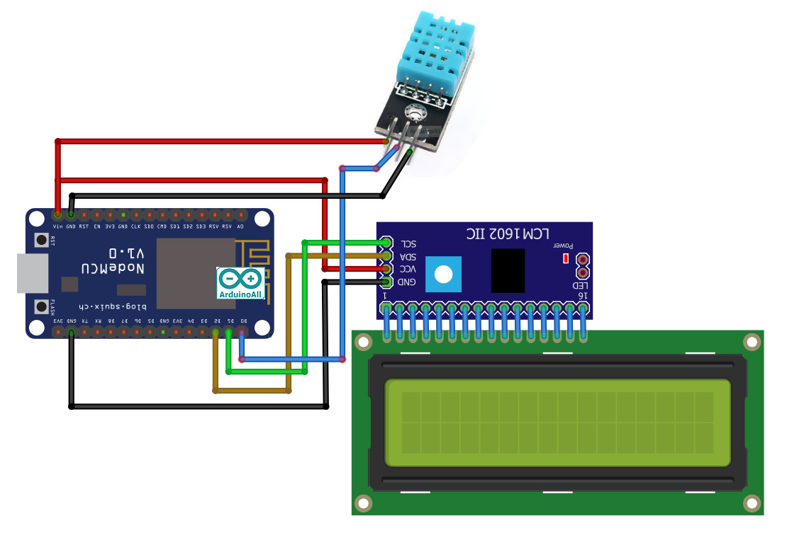

#My Cactus My Garden

---
## Objective
*
*

## Equipments and Devices
<image src="image/1.jpg" width="33%" height="33%"><image src="image/2.jpg" width="33%" height="33%"><image src="image/3.jpg" width="33%" height="33%">
<image src="image/4.jpg" width="33%" height="33%">
<image src="image/5.jpg" width="33%" height="33%">
<image src="image/6.jpg" width="33%" height="33%">
<image src="image/7.jpg" width="33%" height="33%">
<table>
  <tr><th>วัดถุดิบและอุปกรณ์อื่นๆ</th></tr>
  <tr><td>ฟิวเจอร์บอร์ด</td></tr>
  <tr><td>ปืนกาว</td></tr>
  <tr><td>แบตสำรอง (Powerbank)</td></tr>
</table>

## Built With
* Arduino Uno (NodeMCU Esp8266 Wifi V.2)
* Blynk
* C++

## How it works
*
*

## Code
* [Project File](https://github.com/peeza2231/Mini-Project-ComPro-KMITL/tree/master/Code)

## System Diagram
* Temperature Diagram

## Presentation
* [Youtube]
* [Poster]

## Contributors
|Student ID|Name|User Github|
|--|--|--|
|62070081|Thanawat Phongrat|[thanawat15](https://github.com/thanawat15)|
|62070173|Weatphom Mamak|[Warlord5588](https://github.com/thanawat15)|
|62070191|Sompob Saksrichai|[peeza2231](https://github.com/peeza2231)|
|62070210|Surawit Supornrutai|[surawit-srw](https://github.com/surawit-srw)|

## Special Thanks to
* Panwit Tuwanut
* Kitsuchart Pasupa

<image src="image/itlogo.png" width="250px" height="200px">

